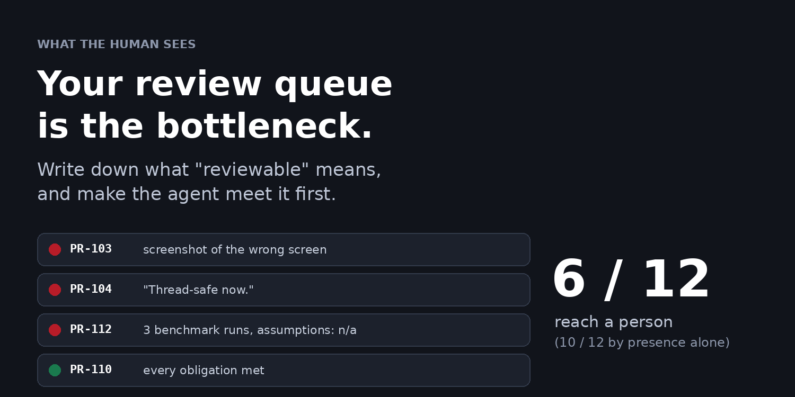
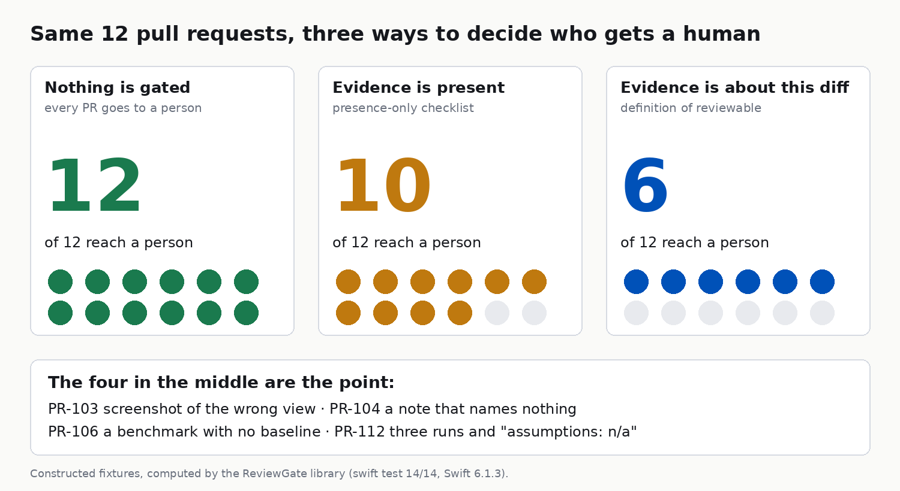

# A Checklist Passed 10 of 12 Pull Requests. Four Agent-Written PRs Weren't Reviewable.

*Agents made code cheap and left review as the bottleneck. I wrote a "definition of reviewable" as a Swift gate and ran it on 12 test PRs. The failure that mattered was evidence about the wrong diff.*



Picture a pull request with a screenshot, a benchmark and a tidy "assumptions" section. Now picture the reviewer discovering, halfway through the review, that the screenshot shows the Feed screen and the change is in Settings.

That scene is the review-readiness problem, and agents made it worse. When an agent writes the diff, writing stopped being the slow part. The slow part is a senior engineer working out what the diff touched, whether it was checked, and what the agent quietly decided on the way. Review used to be judgment. Now much of it is discovery.

My position: a lead should write down what "reviewable" means, per surface, and make the author (human or agent) meet it before a person opens the PR. Not a template: a gate that returns a verdict.

I built one to see where it bites. The code is at [github.com/rajatslakhina/review-readiness-gate-article-demo](https://github.com/rajatslakhina/review-readiness-gate-article-demo).

---

## Five surfaces that are expensive to discover by hand

iOS diffs hide their risk in a few predictable places, and each one has a kind of evidence that would make the risk visible.

UI changes need a screenshot or a snapshot diff. Concurrency-relevant code (`@MainActor`, `actor`, `nonisolated`, a bare `Task {`) needs a note about isolation. Entitlement and privacy-manifest files need a note about what changed and why. Hot-path code needs a benchmark delta. And an agent-authored PR that spans several files needs a list of the assumptions it made, because an agent decides silently and a human usually mentions it in the thread.

The classifier that decides which surfaces a diff touches is deliberately dumb: file paths and added lines, nothing else. A reviewer has to be able to predict its answer. If they can't, they'll stop trusting it the first time it surprises them. That is the same instinct behind [SwiftFairy](https://nilcoalescing.com/blog/IntroducingSwiftFairy/), which gives coding agents deterministic review checks instead of more instructions.



---

## Presence is the wrong test

My first mental model was a checklist: is there a screenshot, is there a note, is there a benchmark. Present or absent.

I ran twelve constructed pull requests through three gates. These are fixtures I wrote, each built to exercise one branch of the policy, so they show how the gate behaves and not how often real PRs fail. With nothing gated, all twelve reach a person. With a presence-only checklist, ten do. With the definition of reviewable, six do.

The four in the gap are the whole article. One PR attached a screenshot of the wrong screen. One had an isolation note that said "Thread-safe now." and named nothing. One had a single-run benchmark with no baseline. One had three benchmark runs and an assumptions list that read "n/a". Each of those has the evidence. None of it is about the diff.

So the gate has three states, not two: satisfied, missing, or vacuous. Across the twelve, only two findings were missing. Six were vacuous. The failure I'd have predicted was "the agent forgot." The failure the fixtures were built to show is "the agent produced something shaped like evidence."

```swift
let covered = visual.contains { covers in covers.contains { stems.contains($0) || paths.contains($0) } }
return covered
    ? Finding(surface: .ui, status: .satisfied, reason: "Visual evidence covers a changed view.")
    : Finding(surface: .ui, status: .vacuous,
              reason: "Visual evidence covers none of the changed views (\(list(stems))).")
```

The whole trick is that evidence has to declare what it covers. A screenshot carries the names of the views it shows, and the gate intersects that with the views the diff changed. Empty intersection, vacuous.

---

## Where my own gate disagreed with me

One of my own tests failed on the first run. I had written a small human PR, a Feed view refactor with a snapshot diff, and expected it to pass. It was blocked. `FeedView.swift` lives under `Sources/Feed/`, which my policy lists as a hot path, so a "just a view" refactor needed a benchmark too.

I could have exempted the path. I added the benchmark to the fixture instead, because the gate was right: scroll performance is exactly what a Feed view refactor can regress, and I'd have missed it by calling it cosmetic.

The benchmark rule is the other place I made a call I'd defend in a design review.

```swift
let solid = deltas.contains { d in
    guard let b = d.0, let c = d.1, b > 0, c >= 0 else { return false }
    return d.2 >= policy.minBenchmarkRuns
}
```

Five runs is a policy number, not statistics. It exists to reject one-run "improvements", not to certify a result. You set it from your own noise.

---

## Make the agent meet it, not the reviewer

A gate nobody runs is a document. The point of a verdict is that it can be enforced before a human is involved. In Claude Code that would be a PreToolUse hook on Bash, filtered to `gh pr create`, that exits with code 2 and prints the reasons to stderr, so the agent sees them and fixes them. The repo doesn't include that hook; you'd need a small runner that builds the packet from the diff. The reasons are written to be acted on: "Isolation note is too short or names none of ImageCache." tells the agent what to do next.

The number I'd resist quoting as a saving is the minutes. At default weights the gate blocked 104 minutes of reviewer discovery across the twelve. Those weights are mine (12 UI, 18 concurrency, 10 entitlements, 20 hot path, 8 assumptions). Replace them with your team's history before you put the figure in a slide.

Two limits, stated plainly. I ran `swift build` and `swift test` on Linux, 14 tests passing, but the SwiftUI screen and the Xcode project have never been compiled or opened, and I did not run the app on a Simulator, so the repo has no screenshot of it. And a gate this literal can be gamed: an agent can name the right view in a screenshot of the wrong state. It raises the price of vague evidence, and the person still reviews.

---

> Evidence isn't evidence until it names something in the diff.

If a screenshot can pass review without proving it's about the change, your checklist is measuring effort, not reviewability.

If this was useful, a clap helps it reach the next lead whose PR template only checks that things exist (you can give up to 50). And one question I'd like answered: of the five obligations (UI, isolation, entitlements, benchmark, assumptions), which would your team fight hardest to make a blocker instead of a warning?

*Related reading: Matthaus Woolard, ["Introducing SwiftFairy"](https://nilcoalescing.com/blog/IntroducingSwiftFairy/) (Nil Coalescing), and ["Stop Sleeping: Deterministic Tests for Concurrent Swift Code"](https://raska.io/blog/testing-concurrent-code) (raska.io). The design and all numbers above are mine.*

**Tags:** Swift, iOS Development, Artificial Intelligence, Software Engineering, Programming
